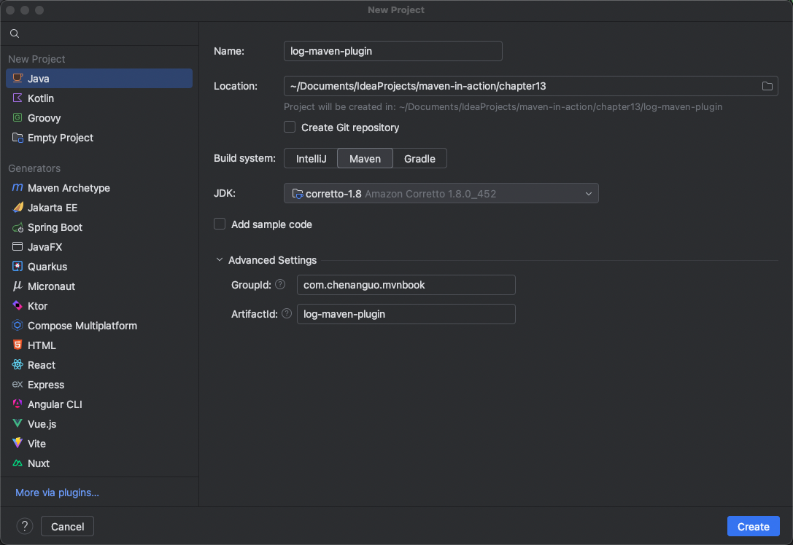

### 第十三章 编写Maven插件


### 创建插件步骤
1. chapter13目录下，新建log-maven-plugin项目：

2. log-maven-plugin项目中，修改pom.xml，新增：
```
    <packaging>maven-plugin</packaging>
```
```
    <dependencies>
        <dependency>
            <groupId>org.apache.maven</groupId>
            <artifactId>maven-plugin-api</artifactId>
            <version>3.9.10</version>
        </dependency>
        <dependency>
            <groupId>org.apache.maven.plugin-tools</groupId>
            <artifactId>maven-plugin-annotations</artifactId>
            <version>3.15.1</version>
        </dependency>
    </dependencies>
```

3. 编写代码：log-maven-plugin/src/main/java/com/chenanguo/mvnbook/LogMojo.java

4. 安装到本地仓库：`mvn install`

5. Maven命令行调用插件的log目标（使用message参数的默认值）：`mvn com.chenanguo.mvnbook:log-maven-plugin:1.0-SNAPSHOT:log`

6. Maven命令行调用插件的log目标（message参数传入值）：`mvn com.chenanguo.mvnbook:log-maven-plugin:1.0-SNAPSHOT:log -Dmessage='Hello Tom.'`