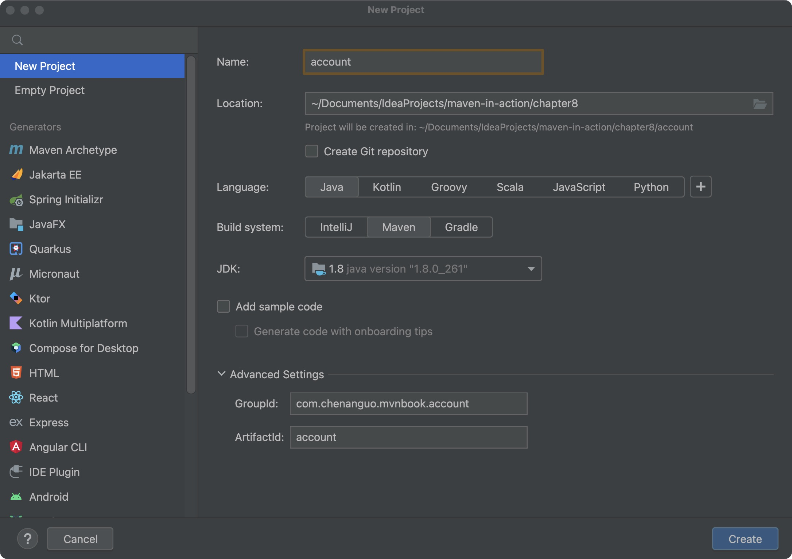
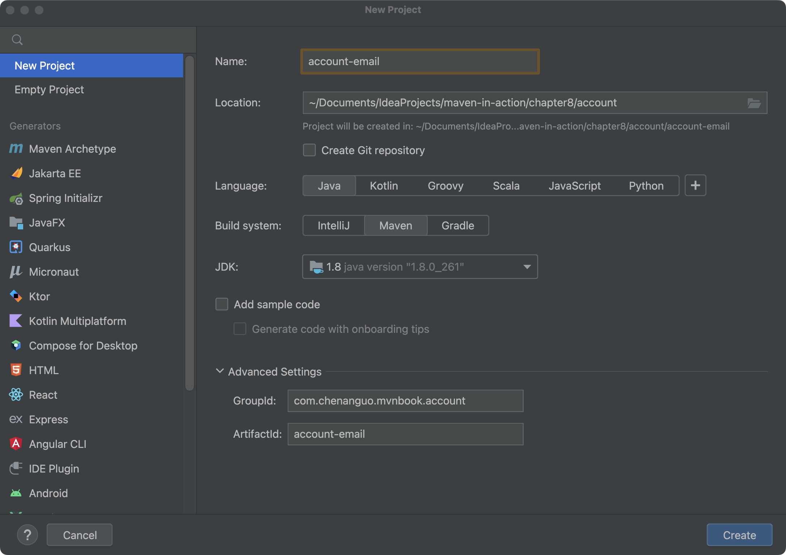
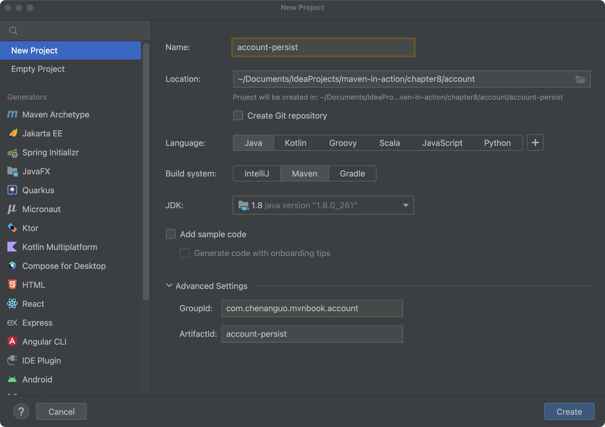

### 第八章 聚合与继承

软件设计人员往往会采用各种方式对软件划分模块，以得到更清晰的设计及更高的重用性。当把Maven应用到实际项目中的时候，也需要将项目分成不同的模块。

<strong><span style="color:red;">Maven的聚合特性能够把项目的各个模块聚合在一起构建，而Maven的继承特性则能帮助抽取各模块相同的依赖和插件等配置，在简化POM的同时，还能促进各个模块配置的一致性。</span></strong>

#### 8.1 新建项目：account、account-email、account-persist
在chapter8目录下，新建account项目：

在chapter8/account目录下，新建account-email项目：

在chapter8/account目录下，新建account-persist项目：


account-persist模块与account-email模块的groupId和version完全一致，而且artifactId也有相同的前缀。一般来说，一个项目的子模块都应该使用同样的groupId，如果它们一起开发和发布，还应该使用同样的version，此外，它们的artifactId还应该使用一致的前缀，以方便同其他项目区分。

#### 8.2 聚合
<strong><span style="color:red;">我们想要一次构建两个项目，而不是到两个模块的目录下分别执行mvn命令。Maven聚合（或者称为多模块）这一特性就是为该需求服务的。</span></strong>

为了能够使用一条命令就能构建account-email和account-persist两个模块，我们修改account/pom.xml:
1. 添加`<packaging>pom</packaging>`，<strong><span style="color:red;">对于聚合模块来说，其打包方式packaging的值必须为pom，否则就无法构建。</span></strong>
2. <strong><span style="color:red;">添加元素modules，这是实现聚合的最核心的配置。用户可以通过在一个打包方式为pom的Maven项目中声明任意数量的module元素来实现模块的聚合。这里每个module的值都是一个当前POM的相对目录。</span></strong>account-email、account-persist这两个目录各自包含了pom.xml、src/main/java/、src/test/java/等内容，离开account也能独立构建。
```
<modules>
    <module>account-email</module>
    <module>account-persist</module>
</modules>
```

为了方便用户构建项目，通常将聚合模块放在项目目录的最顶层，其他模块则作为聚合模块的子目录存在，这样当用户得到源码的时候，第一眼发现的就是聚合模块的POM，不用从多个模块中去寻找聚合模块来构建整个项目。

从聚合模块即目录chapter8/account，运行mvn clean install命令会看到部分输出如下：
```
[INFO] Scanning for projects...
[INFO] ------------------------------------------------------------------------
[INFO] Reactor Build Order:
[INFO] 
[INFO] account-email                                                      [jar]
[INFO] account-persist                                                    [jar]
[INFO] account                                                            [pom]
```
<strong><span style="color:red;">Maven会首先解析聚合模块的POM、分析要构建的模块、并计算出一个反应堆构建顺序（Reactor Build Order），然后根据这个顺序依次构建各个模块。反应堆是所有模块组成的一个构建结构。</span></strong>

#### 8.3 继承

##### 8.3.1 继承父模块
到目前为止，account已经是聚合模块，现在我们让account-email和account-persist都继承account，使account成为父模块。

作为父模块的POM，其打包类型packaging也必须为pom。父模块不包含除POM之外的项目文件。

account-email/pom.xml、account-persist/pom.xml，都添加：
```
<parent>
    <groupId>com.chenanguo.mvnbook.account</groupId>
    <artifactId>account</artifactId>
    <version>1.0-SNAPSHOT</version>
    <relativePath>../pom.xml</relativePath>
</parent>
```
上述POM中使用parent元素声明父模块，parent下的子元素groupId、artifactId和version指定了父模块的坐标，这三个元素是必须的。<strong><span style="color:red;">元素relativePath表示父模块POM的相对路径</span></strong>，该例中的../pom.xml表示父POM的位置在account-email/目录上级的account/目录下。当项目构建时，Maven会首先根据relativePath检查父POM，如果找不到，再从本地仓库查找。relativePath的默认值是../pom.xml，也就是说，Maven默认父POM在上一层目录下。

如果遇到子模块需要使用和父模块不一样的groupId或者version的情况，那么用户完全可以在子模块中显式声明。

##### 8.3.2 可继承的POM元素
哪些POM元素可以被继承呢？以下是一个完整的列表，并附带了简单的说明：
1. groupId：项目组ID，项目坐标的核心元素。
2. version：项目版本，项目坐标的核心元素。
3. description：项目的描述信息。
4. organization：项目的组织信息。
5. inceptionYear：项目的创始年份。
6. url：项目的URL地址。
7. developers：项目的开发者信息。
8. contributors：项目的贡献者信息。
9. <strong><span style="color:red;">distributionManagement：项目的部署配置。</span></strong>
10. issueManagement：项目的缺陷跟踪系统信息。
11. ciManagement：项目的持续集成系统信息。
12. scm：项目的版本控制系统信息。
13. mailingLists：项目的邮件列表信息。
14. <strong><span style="color:red;">properties：自定义的Maven属性。</span></strong>
15. <strong><span style="color:red;">dependencies：项目的依赖配置。</span></strong>
16. <strong><span style="color:red;">dependencyManagement：项目的依赖管理配置。</span></strong>
17. <strong><span style="color:red;">repositories：项目的仓库配置。</span></strong>
18. <strong><span style="color:red;">build：包括项目的源码目录配置、输出目录配置、插件配置、插件管理配置等。</span></strong>
19. reporting：包括项目的报告输出目录配置、报告插件配置等。

##### 8.3.3 依赖管理
<strong><span style="color:red;">Maven提供的dependencyManagement元素既能让子模块继承到父模块的依赖配置，又能保证子模块依赖使用的灵活性。在dependencyManagement元素下的依赖声明不会引入实际的依赖，不过它能够约束dependencies下的依赖使用。</span></strong>

在account/pom.xml中配置dependencyManagement元素：
```
    <dependencyManagement>
        <dependencies>
            <dependency>
                <groupId>junit</groupId>
                <artifactId>junit</artifactId>
                <version>4.13.2</version>
                <scope>test</scope>
            </dependency>
        </dependencies>
    </dependencyManagement>
```
这里使用dependencyManagement声明的依赖既不会给account引入依赖，也不会给它的子模块引入依赖，不过这段配置是会被继承的。

account-email/pom.xml、account-persist/pom.xml中配置dependencies元素：
```
    <dependencies>
        <dependency>
            <groupId>junit</groupId>
            <artifactId>junit</artifactId>
        </dependency>
    </dependencies>
```
<strong><span style="color:red;">上述POM中的依赖配置较原来简单了一些，依赖只配置了groupId和artifactId，省去了version和依赖范围scope。这些信息可以省略是因为account-email继承了account中的dependencyManagement配置，完整的依赖声明已经包含在父POM中，子模块只需要配置简单的groupId和artifactId就能获得对应的依赖信息，从而引入正确的依赖。</span></strong>

父POM中使用dependencyManagement声明依赖能够统一项目范围中依赖的版本，当依赖版本在父POM中声明之后，子模块在使用依赖的时候就无须声明版本，也就不会发生多个子模块使用依赖版本不一致的情况。这可以帮助降低依赖冲突的几率。

<strong><span style="color:red;">如果子模块不声明依赖的使用，即使该依赖已经在父POM的dependencyManagement中声明了，也不会产生任何实际的效果。</span></strong>

<strong><span style="color:red;">名为import的依赖范围，只在dependencyManagement元素下才有效果，使用该范围的依赖通常指向一个POM，作用是将目标POM中的dependencyManagement配置导入并合并到当前POM的dependencyManagement元素中。</span></strong>

想要在另外一个模块中使用完全一样的dependencyManagement配置，除了复制配置或者继承这两种方式之外，还可以使用import范围依赖将这一配置导入。
```
<dependencyManagement>
    <dependencies>
        <dependency>
            <groupId>com.chenanguo.mvnbook.account</groupId>
            <artifactId>account</artifactId>
            <version>1.0-SNAPSHOT</version>
            <type>pom</type>
            <scope>import</scope>
        </dependency>
    </dependencies>
</dependencyManagement>
```
上述代码中依赖的type值为pom，import范围依赖由于其特殊性，一般都是指向打包类型为pom的模块。如果有多个项目，它们使用的依赖版本都是一致的，则就可以定义一个使用dependencyManagement专门管理依赖的POM，然后在各个项目中导入这些依赖管理配置。

##### 8.3.4 插件管理
Maven也提供了pluginManagement元素帮助管理插件。在该元素中配置的依赖不会造成实际的插件调用行为，当POM中配置了真正的plugin元素，并且其groupId和artifactId与pluginManagement中配置的插件匹配时，pluginManagement的配置才会影响实际的插件行为。

#### 8.4 聚合与继承的关系
多模块Maven项目中的聚合与继承其实是两个概念，其目的完全是不同的。前者主要是为了方便快速构建项目，后者主要是为了消除重复配置。

聚合POM与继承关系中的父POM的packaging都必须是pom，同时，聚合模块与继承关系中的父模块除了POM之外都没有实际的内容。

在现有的实际项目中，读者往往会发现一个POM既是聚合POM，又是父POM，这么做主要是为了方便。我们的account/pom.xml就是这样使用的，包含了一个modules元素，表示用来聚合account-persist和account-email两个模块，它还包含了dependencyManagement元素供子模块继承。

#### 8.5 约定优于配置
Maven提倡“约定优于配置”（Convention Over Configuration），这是Maven最核心的设计理念之一。那么为什么要使用约定而不是自己更灵活的配置呢？原因之一是，使用约定可以大量减少配置。

<strong><span style="color:red;">任何一个Maven项目都隐式地继承超级POM，超级POM的配置也就成为了Maven所提倡的约定。</span></strong>

对于Maven 3，超级POM在文件$MAVEN_HOME/lib/maven-model-builder-x.x.x.jar中的org/apache/maven/model/pom-4.0.0.xml路径下。这里的x.x.x表示Maven的具体版本。

Maven
3.9.x版本的超级POM：https://github.com/apache/maven/blob/maven-3.9.x/maven-model-builder/src/main/resources/org/apache/maven/model/pom-4.0.0.xml 。

超级POM实际上很简单，但从这个POM我们就能够知晓Maven约定的由来，不仅理解了什么是约定，为什么要遵循约定，还能明白约定是如何实现的。

#### 8.6 反应堆
<strong><span style="color:red;">在一个多模块的Maven项目中，反应堆（Reactor）是指所有模块组成的一个构建结构。反应堆包含了各模块之间继承与依赖的关系，从而能够自动计算出合理的模块构建顺序。</span></strong>

##### 8.6.1 反应堆的构建顺序
实际的构建顺序是这样形成的：Maven按序读取POM，如果该POM没有依赖模块，那么就构建该模块，否则就先构建其依赖模块，如果该依赖还依赖于其他模块，则进一步先构建依赖的依赖。

模块间的依赖关系会将反应堆构成一个有向非循环图（Directed Acyclic Graph,DAG），各个模块是该图的节点，依赖关系构成了有向边。这个图不允许出现循环，因此，当出现模块A依赖于B，而B又依赖于A的情况时，Maven就会报错。

##### 8.6.2 裁剪反应堆
有些时候，用户想要仅仅构建完整反应堆中的某些模块。换句话说，用户需要实时地裁剪反应堆。

Maven提供很多的命令行选项支持裁剪反应堆，输入mvn-h可以看到这些选项：
1. -am,--also-make 同时构建所列模块的依赖模块
2. -amd,--also-make-dependents 同时构建依赖于所列模块的模块
3. -pl,--projects <arg> 构建指定的模块，模块间用逗号分隔
4. -rf,--resume-from <arg> 从指定的模块继续反应堆

在开发过程中，灵活应用上述4个参数，可以帮助我们跳过无须构建的模块，从而加速构建。