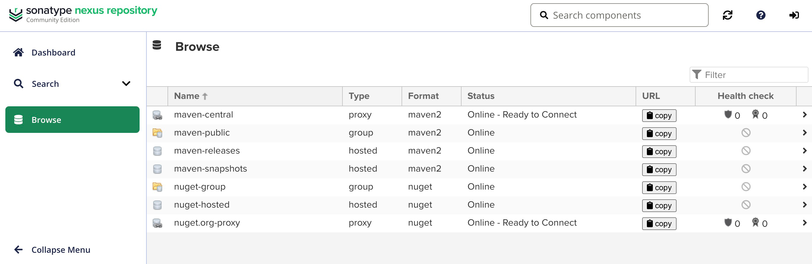
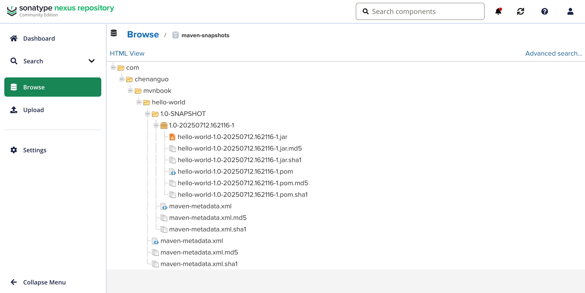

### 第九章 使用Nexus创建私服

#### 9.1 Nexus简介

通过建立自己的私服，就可以降低中央仓库负荷、节省外网带宽、加速Maven构建、自己部署构件等，从而高效地使用Maven。

<strong><span style="color:red;">Nexus是当前最流行的Maven仓库管理软件。</span></strong>

Nexus分为社区版Community Edition和专业版Pro Edition，其中社区版特性足以满足大部分Maven用户的需要。

#### 9.2 安装Nexus社区版Community Edition

> 安装详见：https://help.sonatype.com/en/install-nexus-repository.html

1. 打开页面：https://www.sonatype.com/products/nexus-community-edition-download ，填写“Get Started for Free”信息后，点击“Download”，进入选择相应操作系统的界面，点击进行下载。
2. 我选择操作系统：macOS x86 (Intel)后，下载的安装文件：nexus-3.81.1-01-mac-x86_64.tar.gz
3. 解压安装文件：tar xvzf nexus-3.81.1-01-mac-x86_64.tar.gz
4. cd nexus-3.81.1-01-mac-x86_64/nexus-3.81.1-01/bin
5. 启动Nexus Repository：`./nexus start`
6. 打开Nexus网址：http://127.0.0.1:8081/
7. admin用户的密码，修改为：chenanguo。
8. 登录后，在页面：http://127.0.0.1:8081/#admin/repository/repositories ，查看仓库和新建仓库。

解压安装文件，得到两个子目录：
1. nexus-3.81.1-01/：该目录包含了Nexus运行所需要的文件，如启动脚本、依赖jar包等。
2. sonatype-work/：该目录包含Nexus生成的配置文件、日志文件、仓库文件等。

其中，第一个目录是运行Nexus所必需的，而且所有相同版本Nexus实例所包含的该目录内容都是一样的。而<strong><span style="color:red;">第二个目录不是必须的，Nexus会在运行的时候动态创建该目录，不过它的内容对于各个Nexus实例是不一样的，因为不同用户在不同机器上使用的Nexus会有不同的配置和仓库内容。当用户需要备份Nexus的时候，默认备份sonatype-work/目录</span></strong>，因为该目录包含了用户特定的内容，而nexus-3.81.1-01目录下的内容是可以从安装包直接获得的。

Nexus拥有全面的权限控制功能，默认的Nexus访问都是匿名的，而匿名用户仅包含一些最基本的权限，要全面学习和管理Nexus，就必须以管理员方式登录。可以单击界面右上角的Log In图标进行登录。

#### 9.3 Nexus的仓库与仓库组

##### 9.3.1 Nexus内置的仓库
单击Nexus界面左边导航栏中的Browse链接，就能在界面看到下图所示的内容。


<strong><span style="color:red;">Maven仓库有三种类型：group（仓库组）、hosted（宿主）、proxy（代理）。Maven仓库的格式为maven2。此外，仓库还有一个属性为Version policy（策略），表示该仓库为发布（Release）版本仓库、快照（Snapshot）版本仓库或混合（Mixed）版本仓库。包含列：仓库的状态Status、路径URL。</span></strong>每一种仓库都提供了丰富实用的配置参数，方便用户根据需要进行定制。

下面解释一下各个仓库的用途：
1. maven-central：该仓库代理Maven中央仓库，其策略为Release，因此只会下载和缓存中央仓库中的发布版本构件。 
2. maven-releases：这是一个策略为Release的宿主类型仓库，用来部署组织内部的发布版本构件。
3. maven-snapshots：这是一个策略为Snapshot的宿主类型仓库，用来部署组织内部的快照版本构件。
4. maven-public：该仓库组将上述3个仓库聚合并通过一致的地址提供服务，Version policy为Mixed。

##### 9.3.2 Nexus仓库分类的概念
各种类型的Nexus仓库：


Maven可以直接从宿主仓库下载构件；Maven也可以从代理仓库下载构件，而代理仓库会间接地从远程仓库下载并缓存构件；最后，为了方便，Maven可以从仓库组下载构件，而仓库组没有实际内容（图中用虚线表示）​，它会转向其包含的宿主仓库或者代理仓库获得实际构件的内容。

仓库组所包含的仓库的顺序决定了仓库组遍历其所含仓库的次序，因此最好将常用的仓库放在前面，当用户从仓库组下载构件的时候，就能够尽快地访问到包含构件的仓库。

#### 9.4 Nexus构件搜索
单击Nexus界面左边导航栏中的Search链接，可以搜索构件。

#### 9.5 配置Maven从Nexus下载构件

<strong><span style="color:red;">当需要为本机所有的Maven项目添加Nexus私服上的public仓库时，settings.xml并不支持直接配置repositories和pluginRepositories。所幸Maven还提供了Profile机制，能让用户将仓库配置放到setting.xml中的Profile中。</span></strong>
```
<settings>
    <profiles>
        <profile>
            <id>nexus</id>
            <repositories>
                <repository>
                    <id>central</id>
                    <url>http://localhost:8081/repository/maven-public/</url>
                    <releases>
                        <enabled>true</enabled>
                    </releases>
                    <snapshots>
                        <enabled>true</enabled>
                    </snapshots>
                </repository>
            </repositories>
            <pluginRepositories>
                <pluginRepository>
                    <id>central</id>
                    <url>http://localhost:8081/repository/maven-public/</url>
                    <releases>
                        <enabled>true</enabled>
                    </releases>
                    <snapshots>
                        <enabled>true</enabled>
                    </snapshots>
                </pluginRepository>
            </pluginRepositories>
        </profile>
    </profiles>
    <activeProfiles>
        <activeProfile>nexus</activeProfile>
    </activeProfiles>
</settings>
```

<strong><span style="color:red;">我们希望的是所有Maven下载请求都仅仅通过Nexus，以全面发挥私服的作用。这个时候就需要借助于6.7节提到的Maven镜像配置了。可以创建一个匹配任何仓库的镜像，镜像的地址为私服，这样，Maven对任何仓库的构件下载请求都会转到私服中。</span></strong>
```
<settings>
    <mirrors>
        <mirror>
            <id>nexus</id>
            <mirrorOf>*</mirrorOf>
            <url>http://localhost:8081/repository/maven-public/</url>
        </mirror>
    </mirrors>
<settings>
```

<strong><span style="color:red;">上面的仓库及插件仓库配置，它们的id都为central，也就是说，覆盖了超级POM中央仓库的配置，它们的url已无关紧要，因为所有请求都会通过镜像访问私服地址。配置仓库及插件仓库的主要目的是开启对快照版本下载的支持，当Maven需要下载发布版或快照版构件的时候，它首先检查central，看该类型的构件是否支持，得到正面的回答之后，再根据镜像匹配规则转而访问私服仓库地址。</span></strong>

#### 9.6 部署构件至Nexus
宿主仓库的主要作用是储存组织内部的，或者一些无法从公共仓库中获得的第三方构件，供大家下载使用。用户可以配置Maven自动部署构件至Nexus的宿主仓库。

<strong><span style="color:red;">日常开发生成的快照版本构件可以直接部署到Nexus中策略为Snapshot的宿主仓库中，项目正式发布的构件则应该部署到Nexus中策略为Release的宿主仓库中。</span></strong>POM的配置方式：
```
<project>
    <distributionManagement>
        <repository>
            <id>nexus-releases</id>
            <name>Nexus Releases Repository</name>
            <url>http://localhost:8081/repository/maven-releases/</url>
        </repository>
        <snapshotRepository>
            <id>nexus-snapshots</id>
            <name>Nexus Snapshots Repository</name>
            <url>http://localhost:8081/repository/maven-snapshots/</url>
        </snapshotRepository>
    </distributionManagement>
</project>
```
<strong><span style="color:red;">Nexus的仓库对于匿名用户是只读的。为了能够部署构件，还需要在settings.xml中配置认证信息</span></strong>（这里的密码，为安装Nexus时为admin设置的密码）：
```
<settings>
    <servers>
        <server>
            <id>nexus-releases</id>
            <username>admin</username>
            <password>chenanguo</password>
        </server>
        <server>
            <id>nexus-snapshots</id>
            <username>admin</username>
            <password>chenanguo</password>
        </server>
    </servers>
</settings>
```
<strong><span style="color:red;">settings.xml中server元素的id必须与POM中需要认证的repository元素的id完全一致。换句话说，正是这个id将认证信息与仓库配置联系在了一起。</span></strong>

将chapter3/hello-world部署到Nexus：
1. chapter3/hello-world/pom.xml中，添加上面的distributionManagement部分
2. 复制完整的chapter9/settings.xml到~/.m2目录下
3. chapter3/hello-world/文件夹下，运行：mvn clean deploy；deploy插件的deploy目标输出：
```
[INFO] --- deploy:3.1.0:deploy (default-deploy) @ hello-world ---
[INFO] Artifact org.codehaus.plexus:plexus-utils:jar:3.5.0 is present in the local repository, but cached from a remote repository ID that is unavailable in current build context, verifying that is downloadable from [nexus (http://localhost:8081/repository/maven-public/, default, releases+snapshots)]
[INFO] Artifact org.codehaus.plexus:plexus-utils:jar:3.5.0 is present in the local repository, but cached from a remote repository ID that is unavailable in current build context, verifying that is downloadable from [nexus (http://localhost:8081/repository/maven-public/, default, releases+snapshots)]
Downloading from nexus: http://localhost:8081/repository/maven-public/org/codehaus/plexus/plexus-utils/3.5.0/plexus-utils-3.5.0.jar
Downloaded from nexus: http://localhost:8081/repository/maven-public/org/codehaus/plexus/plexus-utils/3.5.0/plexus-utils-3.5.0.jar (0 B at 0 B/s)
Downloading from nexus-snapshots: http://localhost:8081/repository/maven-snapshots/com/chenanguo/mvnbook/hello-world/1.0-SNAPSHOT/maven-metadata.xml
Uploading to nexus-snapshots: http://localhost:8081/repository/maven-snapshots/com/chenanguo/mvnbook/hello-world/1.0-SNAPSHOT/hello-world-1.0-20250712.162116-1.pom
Uploaded to nexus-snapshots: http://localhost:8081/repository/maven-snapshots/com/chenanguo/mvnbook/hello-world/1.0-SNAPSHOT/hello-world-1.0-20250712.162116-1.pom (2.3 kB at 30 kB/s)
Uploading to nexus-snapshots: http://localhost:8081/repository/maven-snapshots/com/chenanguo/mvnbook/hello-world/1.0-SNAPSHOT/hello-world-1.0-20250712.162116-1.jar
Uploaded to nexus-snapshots: http://localhost:8081/repository/maven-snapshots/com/chenanguo/mvnbook/hello-world/1.0-SNAPSHOT/hello-world-1.0-20250712.162116-1.jar (3.2 kB at 64 kB/s)
Downloading from nexus-snapshots: http://localhost:8081/repository/maven-snapshots/com/chenanguo/mvnbook/hello-world/maven-metadata.xml
Uploading to nexus-snapshots: http://localhost:8081/repository/maven-snapshots/com/chenanguo/mvnbook/hello-world/1.0-SNAPSHOT/maven-metadata.xml
Uploaded to nexus-snapshots: http://localhost:8081/repository/maven-snapshots/com/chenanguo/mvnbook/hello-world/1.0-SNAPSHOT/maven-metadata.xml (776 B at 13 kB/s)
Uploading to nexus-snapshots: http://localhost:8081/repository/maven-snapshots/com/chenanguo/mvnbook/hello-world/maven-metadata.xml
Uploaded to nexus-snapshots: http://localhost:8081/repository/maven-snapshots/com/chenanguo/mvnbook/hello-world/maven-metadata.xml (290 B at 6.9 kB/s)
```
4. 在maven-snapshots仓库，可以看到我们成功部署的hello-world构件。

